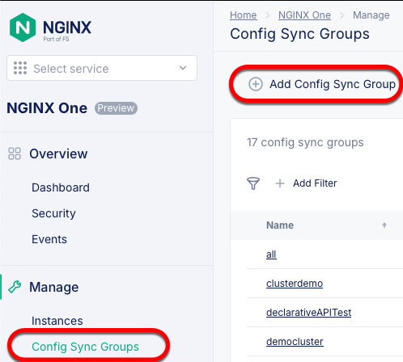
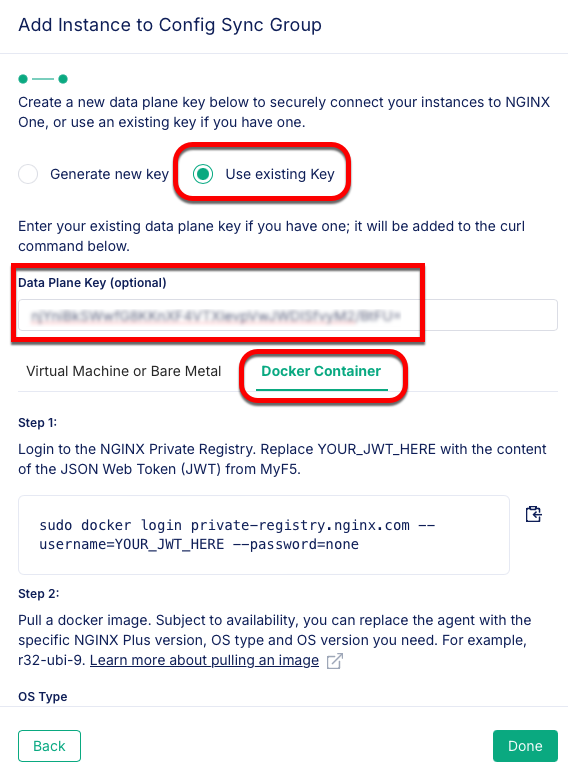
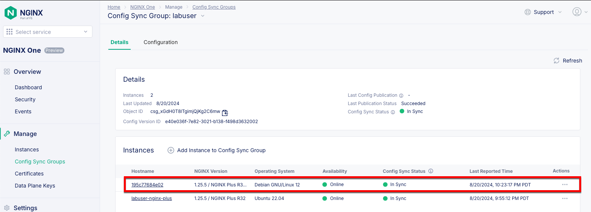
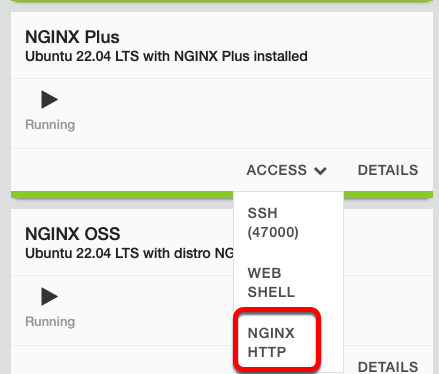
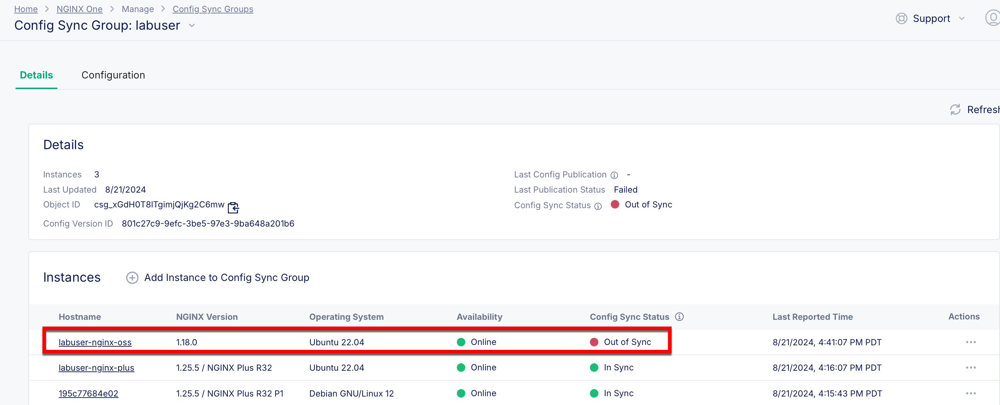
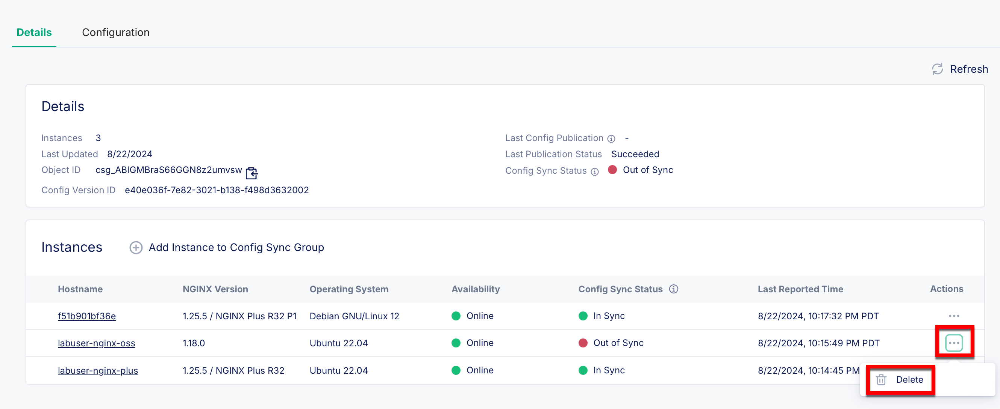

# NGINX One

NGINX made big news at the F5 annual user conference, [AppWorld](https://www.f5.com/appworld), by introducing [NGINX One](https://www.nginx.com/introducing-nginx-one/). NGINX One will give all F5 and NGINX customers access to a SaaS console for managing NGINX instances as part of the [F5 Distributed Cloud](https://www.f5.com/cloud). **NGINX One is released for testing in Early Access, and will be GA (Generally Available) in September.**

We’re excited to share that the NGINX One Early Access Program is available to you today! You can sign up here to participate: [https://www.nginx.com/nginx-one-early-participant-access/](https://www.nginx.com/nginx-one-early-participant-access/)

Once live, NGINX One will give NGINX users unrivaled visibility, delivery and optimization capabilities combined with the speed and flexibility of the F5 Distributed Cloud Platform.

You will be able to accelerate application delivery and time-to-value like never before with flexible pricing and SaaS capabilities.

With NGINX One, you will get improved:

- Performance at scale
- Visibility and insight
- Security and control

## Introduction

This lab will give you an overview of how NGINX One provides visibility into a global fleet of NGINX instances, both NGINX Plus and NGINX Open Source (OSS).

NGINX One is currently in Early Access, and the implemented feature set is growing all the time. The features and capabilities of the NGINX One offering are expected to continue to grow up to and beyond General Availability.

After this lab, you will be able to:

- Access and navigate the NGINX One console,
- Install the NGINX Agent on both NGINX Plus and NGINX OSS instances
- Manage NGINX configuration, and
- Review recommendations from the NGINX One console

## Prerequisites

### F5 Distributed Cloud Access

You will use your existing F5 XC Sales tenant to complete this lab. If you do not have access to F5 XC, work with your SE team to get onboarded.

### UDF Blueprint

The "NGINX One Enablement Lab" blueprint contains the NGINX Plus and NGINX OSS instances that you will use during this lab. You should be comfortable accessing resources in UDF using SSH.

## Lab 1: Accessing the NGINX One Console

1. Log into your F5 Distributed Cloud Sales tenant.

1. Select the "NGINX One" product from the home screen.

    

1. The NGINX One welcome screen will appear. Click "Visit Service" to proceed to the NGINX One console.

    

1. The NGINX One Dashboard shows an overview of your environment, including availability, platform and version distribution, and CVEs/configuration recommendations. Your dashboard will vary depending on what is installed in your tenant. Feel free to click around and explore.

    

1. In the left-hand menu in the "Manage" section is the "Instances" link. You may or may not have any existing instances in your tenant. Don’t worry if there aren’t any, you will be deploying two instances later in the lab. If there are any existing instances, click an instance’s hostname to view its details.

    

1. Review the following demo for an overview of the types of data and findings available from the NGINX One Dashboard:

    [Vivun Demo Automation - NGINX One](https://app.revel.vivun.com/demos/13885df7-5333-4182-8d57-fcba3d0cbd28/paths/4be83a03-f942-4eb2-80db-174046d15e0c)

    > :point_right: **Note:** You may experience rendering issues viewing the demo on a smaller screen. Try maximizing your browser window if you experience any issues.

## Lab 2: Connecting NGINX Plus to NGINX One

NGINX One uses an agent installed alongside NGINX to communicate with the NGINX One service.


The agent uses a Data Plane Key to authenticate and identify itself to NGINX One. In this lab we will create a new Data Plane Key, and use it to install the NGINX Agent on the NGINX Plus instance.

### Connecting to the lab environment

The requirements for this lab are minimal. If you prefer working directly from your workstation, you can SSH directly into the lab machines. If you would rather work from a jumphost, that option is available as well.

#### Option 1: Direct access

1. Navigate to the "Components" tab in UDF.

1. Under the "Systems" column, find the system you want to connect to and drop down the "Access Methods" option.

1. Click the "SSH (47000)" option. If your computer is configured with a handler for the SSH protocol, your SSH client should open automatically.

#### Option 2: Jumphost

1. Navigate to the "Components" tab in UDF.

1. Under the "Systems" column, find the "Linux Jumphost" system and drop down the "Access Methods" option.

1. Click the "RDP" option. Depending on your computer’s configuration, either your RDP Client will open automatically, or it will download an .rdp file and you will need to double-click it to connect.

1. Log into the jumphost with the username **"user"** and password **"user"**.

    

1. Click the "Terminal Emulator" icon in the dock to open a terminal.

1. Enter the following command, substituting **ip-address** with the address of the system you are connecting to.

    ```bash
    ssh ubuntu@ip-address
    ```

    

### Generating a Data Plane Key

1. From the NGINX One console, in the left hand menu under the "Manage" section, select "Data Plane Keys".

1. Click "Add Data Plane Key".

1. Give the key a name. Other users in your tenant will see this object, so be sure to name it in a way that identifies it as yours. A suggested format is "yourname-nginx-key".

    > :point_right: **Note:** You are working in a shared tenant; keep track of your resources, and be careful not to accidently modify anyone else's.

1. Click "Generate"

    

1. The Data Plane Key will be displayed. Click the "Copy" icon to copy the key to the clipboard.

    > :warning: **Warning:** *SAVE THIS KEY SOMEWHERE SAFE.* There is no way to retrieve the key after you click close. This key will be used in multiple labs.

    

### Installing NGINX Agent on NGINX Plus

1. Connect to the "NGINX Plus" instance in UDF, either directly through SSH or through the jumphost. If connecting through the jumphost, the SSH command will be:

    ```bash
    ssh ubuntu@10.1.1.4
    ```

1. Because the hostname is used as the instance's name in NGINX One, you should change it to something that that identifies the host belongs to you. Ensure that you are working on the NGINX Plus instance (default hostname ip-10-1-1-4), and run the following command, substituting "yourname" with a string that identifies you as the user. Use only lowercase characters and hyphens. Note that the bash prompt will not update immediately; it will continue showing the previous hostname until you log out and log back in. This does not affect the lab.

    ```bash
    sudo hostnamectl set-hostname yourname-nginx-plus
    ```

    > :point_right: **Note:** If you don't change the hostname, it will appear as **ip-10-1-1-4** in the console, along with everybody else who didn't change the hostname, and you won't be able to easily identify your instance later.

1. Observe the running NGINX instance on this machine.

    1. If you are working from the jumphost, open the Chromium browser and navigate to **http://10.1.1.4** <!-- markdownlint-disable-line -->

    2. If you are connecting directly through UDF, locate the "NGINX Plus" component and select the "NGINX HTTP" access method.

    

1. From the NGINX Plus instance, run the following command to install the NGINX Agent. Substitute "data-plane-key" with the key you saved in step 5. Make sure you are working on the NGINX Plus instance; if you accidentally install on the jumphost, the installation will succeed, but there will be no NGINX instance for the agent to connect to and the instance will appear as "Offline". If this occurs, return to step 1 and create a new Data Plane Key.

    ```bash
    curl https://agent.connect.nginx.com/nginx-agent/install | DATA_PLANE_KEY='data-plane-key' sh -s -- -y
    ```

    The install script will install any necessary dependencies and install the NGINX Agent with the appropriate settings for your system. You will see a warning about "stub_status" not being configured. You can ignore that warning for the moment.

1. Return to the NGINX One console. From the left menu in the "Manage" section, click "Instances".

1. You should see your new instance in the list. Click its hostname to view the instance details.

    

1. Explore the instance details:

    

## Lab 3: Configuration Suggestions

In the previous lab, the NGINX Agent installer provided a warning that there was no stub_status found in the NGINX config. We’ll make that change on the NGINX Plus instance, and see the change reflected in NGINX One.

### Adding a stub_status directive

1. From NGINX One console. From the left menu in the "Manage" section, click "Instances".

1. You should see your instance in the list. Click its hostname to view the instance details. You may already have been there from the previous lab.

1. Click the "Configuration" link near the top of the instance screen. You will be presented with the configuration editor.

    

1. Click the "Edit Configuration" button above the editor.

    

1. Select the **etc/nginx/conf.d/demo.conf** file from the tree view on the left side of the configuration editor.

    

1. Edit the selected file to include a location block at the end of the server block with
    the "stub_status" directive. Add the following location block to the server block:

    ```nginx
    location = /nginx_status {
        stub_status;
    }
    ```

    The file should like this:

    ```nginx
    server {
        listen 80 default_server;
        server_name app_server;

        root /usr/share/nginx/html;
        error_log /var/log/nginx/app-server-error.log notice;
        index demo-index.html index.html;
        expires -1;

        sub_filter_once off;
        sub_filter 'server_hostname' '\$hostname';
        sub_filter 'server_address' '\$server_addr:\$server_port';
        sub_filter 'server_url' '\$request_uri';
        sub_filter 'remote_addr' '\$remote_addr:\$remote_port';
        sub_filter 'server_date' '\$time_local';
        sub_filter 'client_browser' '\$http_user_agent';
        sub_filter 'request_id' '\$request_id';
        sub_filter 'nginx_version' '\$nginx_version';
        sub_filter 'document_root' '\$document_root';
        sub_filter 'proxied_for_ip' '\$http_x_forwarded_for';

        location = /nginx_status {
            stub_status;
            access_log off;
        }
    }
    ```

1. You will see that there is a message below the editor: *"1 recommendation found for /etc/nginx/conf.d/demo.conf
Security - Error: stub_status should have access control list defined"*. Why? NGINX One includes a configuration advisor and it identified that exposing the **stub_status** endpoint open to all users is considered a security risk. We can remediate this by adding an ACL to the **/nginx_status** location block to only allow the UDF blueprint network and NGINX Agent (running locally on the instance) to access the stub status endpoint.

    

1. Update the configuration to the following:

    ```nginx
    location /nginx_status {
        stub_status;
        allow 10.0.0.0/8;
        allow 127.0.0.1;
        deny all;
    }
    ```

    Note that the warning should disappear.

1. Click "Next" to display the diff viewer. This view will show you the changes made to the configuration.

    

1. Click "Save and Publish". You will see a status message indicating changes are being published, followed by a success message after several seconds.

    

    

1. Check that the stub_status module is working.

    - If you are working through the jumphost, open Chromium and navigate to **http://10.1.1.4/nginx_status** <!-- markdownlint-disable-line -->

    - If you are connecting directly through UDF, locate the "NGINX Plus" component and select the "NGINX HTTP" access method. Append "/nginx_status" to the end of the address.

    

### Using a TLS certificate

1. In the NGINX One console, edit the "/etc/nginx/conf.d/demo.conf" file again to add the following to the server block:

    ```nginx
    listen 443 ssl;
    ssl_certificate /etc/nginx/ssl/wildcard.f5demos.com.crt.pem;
    ssl_certificate_key /etc/nginx/ssl/wildcard.f5demos.com.key.pem;
    ```

    The entire file should now look as follows:

    ```nginx
    server {
        listen 80 default_server;
        server_name app_server;

        listen 443 ssl;
        ssl_certificate /etc/nginx/ssl/wildcard.f5demos.com.crt.pem;
        ssl_certificate_key /etc/nginx/ssl/wildcard.f5demos.com.key.pem;

        root /usr/share/nginx/html;
        error_log /var/log/nginx/app-server-error.log notice;
        index demo-index.html index.html;
        expires -1;

        sub_filter_once off;
        sub_filter 'server_hostname' '\$hostname';
        sub_filter 'server_address' '\$server_addr:\$server_port';
        sub_filter 'server_url' '\$request_uri';
        sub_filter 'remote_addr' '\$remote_addr:\$remote_port';
        sub_filter 'server_date' '\$time_local';
        sub_filter 'client_browser' '\$http_user_agent';
        sub_filter 'request_id' '\$request_id';
        sub_filter 'nginx_version' '\$nginx_version';
        sub_filter 'document_root' '\$document_root';
        sub_filter 'proxied_for_ip' '\$http_x_forwarded_for';

        location = /nginx_status {
            stub_status;
            allow 10.0.0.0/8;
            allow 127.0.0.1;
            deny all;
        }
    }
    ```

1. Click "Next" to display the diff viewer. This view will show you the changes made to the configuration.

    

1. Click "Save and Publish". You will see a status message indicating changes are being published, followed by a success message after several seconds.

1. Click the "Details" link on the page. You should now see the certificate, its validity status, as well as a new recommendation.

    

1. You can view the configuration, and recommendations, by clicking the "View Configuration" link in the "Configuration Recommendations" section.

    

1. Select the "demo.conf" file from the file picker. Note the blue dots and the number "1" next to demo.conf; the configuration viewer highlights the location(s) of any recommendations it has for the NGINX configuration.

    

## Lab 4: NGINX OSS

NGINX Agent isn’t limited to NGINX Plus; it can also be installed into NGINX Open Source instances. The UDF blueprint contains a second Ubuntu host with the package maintainer’s version of NGINX installed.

### Installing NGINX Agent on NGINX OSS

1. Connect to the "NGINX OSS" instance in UDF, either directly through SSH or through the jumphost. If connecting through the jumphost, the SSH command will be:

    ```bash
    ssh ubuntu@10.1.1.6
    ```

1. Because the hostname is used as the name of the instance in NGINX One, you should change the hostname to something that identifies it as yours. Ensure that you are working on the NGINX OSS instance (default hostname ip-10.1.1.6), and run the following command, substituting "yourname" with a string that identifies you as a user. Use only lowercase characters and hyphens. Note that the bash prompt will not update immediately; it will continue to show the previous hostname unless you log out and log back in. This does not affect the lab.

    ```bash
    sudo hostnamectl set-hostname yourname-nginx-oss
    ```

1. Observe the running NGINX instance on this machine.

    - If you are working from the jumphost, open the Chromium browser and navigate to **http://10.1.1.6/** <!-- markdownlint-disable-line -->

    - If you are connecting directly through UDF, locate the "NGINX OSS" component and select the "NGINX HTTP" access method.

    

1. From the NGINX OSS instance, run the following command to install the NGINX Agent. Substitute data-plane-key with the key you saved in the first lab. Make sure you are working on the NGINX OSS instance; if you accidentally install on the jumphost, the installation will succeed, but there will be no NGINX instance for the agent to connect to and the instance will appear as "Offline". If this occurs, return to the directions in lab 1 to create a new Data Plane Key.

    ```bash
    curl https://agent.connect.nginx.com/nginx-agent/install | DATA_PLANE_KEY='data-plane-key' sh -s -- -y
    ```

    The install script will install any necessary dependencies, and install the NGINX Agent with the appropriate settings for your system. You will see a warning about "stub_status" not being configured. You can ignore that warning.

1. Return to the NGINX One console. From the left menu in the "Manage" section, click "Instances". You should see your new instance in the list.

1. Click its hostname to view the instance details.

    

1. Explore the instance details.

    

    Note that this instance has a different set of configuration recommendations than the vanilla NGINX Plus instance did. Package maintainers may ship NGINX with their own sets of defaults, which may or may not align with best practices. NGINX One provides a centralized view of such recommendations across the organization.

## Lab 5: Config Sync Group

We can group multiple NGINX instances into a Config Sync Group where all instances within this group use an identical configuration. This lab will go through using this feature.

### Creating Config Sync Group

1. Go to the NGINX One console.

1. From the left menu in the "Manage" section, click on "Config Sync Groups".

1. Click on "Add Config Sync Group".

    

1. On the right, provide a name then select "Create" on the bottom. Your new item is now created.

    

You can now explore your Config Sync Group by selecting your item. After you select it, there are two tabs named "Details" and "Configuration". The configuration defined in this group will be used as the one NGINX config to use for all NGINX instances in this group. Notice this is empty when you first create a Config Sync Group. There are two ways to handle the initial configuration.

**Option 1:** When you add the first NGINX instance, the config from the NGINX instance will be used as the config for your Config Sync Group. We will be using this option for this lab.

**Option 2.** You can manually define it before you add any NGINX instances.

1. Click the "Configuration" tab then click on "Edit Configuration"

    

1. A editor window appears that allows you to define the configuration for the NGINX instance.

    

1. You can also add files by clicking on "Add File" but this limited to `/etc/nginx/`.

1. Select "Next" then "Save and Publish"

This lab will proceed with option 1 where the configuration will be auto generated using the first NGINX instance added to this group.

### Adding NGINX to config sync group

We will now proceed with adding an NGINX instance to the Config Sync Group.

#### Adding existing instance

Lets start by adding an existing NGINX Plus instance.

1. Open up your config sync group.

1. Click on "Add Instance to Config Sync Group".

    

1. We will be using an existing NGINX instance so make sure "Add an existing instance to config sync group" is selected then click "Next".

1. The next screen might be missing additional options. Run the following commands on your NGINX Plus instance named, `yourname-nginx-plus`.

    ```bash
    curl https://agent.connect.nginx.com/nginx-agent/install |  DATA_PLANE_KEY="YOUR_DATA_PLANE_KEY" sh -s -- -y -c YOUR_CONFIG_SYNC_GROUP_NAME
    sudo systemctl restart nginx-agent
    ```

1. After `nginx-agent` is restarted, you now see your first NGINX instance added to this Config Sync Group.

    

1. When you select the "Configuration" tab, notice the config here is the same as the config on the NGINX instance we just added.

#### Adding new instance using NGINX Plus container

Now that we added an NGINX instance, lets add another one. But this time, we will add an NGINX Plus container.

The **Linux Jumphost** from the UDF environment has `docker` installed and is setup so it can run an NGINX Plus container image. The container image we will use here is `private-registry.nginx.com/nginx-plus/agent:debian` which has NGINX Plus with the Agent for NGINX One. If you want to see a list of all NGINX Plus with Agent tags, run the command below.

```bash
curl https://private-registry.nginx.com/v2/nginx-plus/agent/tags/list --key YOUR_NGINX_PLUS_KEY --cert YOUR_NGINX_PLUS_CERT
```

1. Go to the "Details" page of your Config Sync Group then click "Add Instance to Config Sync Group"

1. Select "Register a new instance with NGINX One then add to config sync group" then click "Next"

1. If you saved your Data Plane Key from a previous lab, select "Use existing Key". Otherwise select "Generate new key"

1. Provide your Data Plane Key if you selected "Use existing Key"

1. Select the "Docker Container" tab.

    

1. Log in to the **Linux Jumphost**. This system already logged in to the NGINX Private Registry so Step 1 can be skipped.

1. Proceed to Step 2 to pull the container image

1. Then run the command from Step 3 to start the NGINX Plus with Agent container. This command will also add this NGINX instance to your Config Sync Group.

1. Click "Done" to close out the window.

You will now see the second NGINX Plus instance added.



### Updating and publishing configuration

Now that we have two instances in a Config Sync Group. Lets now try to publish a new configuration to all instances. Lets try to create a redirect
We will now make an update to the configuration defined in the config sync group then publish the change

1. On your COnfig Sync Group, go to the "Configuration" tab.

1. Click "Edit Configuration"

    

1. An editor should now appear. We will want to update `demo.conf` so be sure to click on that file.

    

1. Add the following section to the **server** block then click "Next"

    ```bash
    location /redirect/google {
        return 301 https://www.google.com;
    }
    ```

1. The following screen will show a diff between existing and new config.

    

1. Confirm your changes and click "Save and Publish"

We can now confirm the configuration changes on the NGINX instance

1. On the NGINX Plus component in UDF, you can view the `demo.conf` file by running the following from the console.

    ```bash
    cat /etc/nginx/conf.d/demo.conf
    ```

1. On the NGINX Plus container, you can view the `demo.conf` file by running the following

    ```bash
    docker exec NGINX_CONTAINER_NAME cat /etc/nginx/conf.d/demo.conf
    ```

Lets now confirm the behavior on the NGINX Plus instance in UDF. If you are trying to access it through UDF using NGINX HTTP, you can append `/redirect/google` at the end of the browser.




If you are RDP'd into the **Linux Jumphost**, you can confirm the behavior by opening Chromium and navigating to `https://10.1.1.4/redirect/google`.


### Mixing NGINX Plus and NGINX Open Source Instances

You will be able to mix NGINX Plus and NGINX Open Source instances with the exception that the configuration must be compatible with for both instances. For example, you will not be able to publish NGINX Plus unique config to NGINX Open Source.

When you view details from NGINX Open Source, there will be an error message that show this. The status of the NGINX Open Source instance will be "Out of Sync".

We will now show how this works in this section of the lab.

1. Add your NGINX Open Source instance to your config sync group

1. When you add the Open Source instance, the status shows "Out of Sync"

    

1. Click on your Open Source instance to view additional details about this. Notice the error message showing the reason why the configuration cannot be applied.

    

We will not go through the exercise of resolving the configuration such that it will be valid for both instance types. The point here is to show it is possible to mix instances and it is your reasonability to insure the configuration is valid for both NGINX Plus and NGINX Open Source.

### Removing OR Changing NGINX Instances from Config Sync Group

We will now go though the steps for removing instances from config sync groups. In the example here, the main configuration from our config sync group is not compatiable with NGINX Open Source and we decided to remove it.

To remove NGINX Open Source from this instance group:

1. Open console access to your NGINX Open Source instance.

1. Open `/var/lib/nginx-agent/agent-dynamic.conf` in a text editor and remove or comment out the following line.

    ```bash
    instance_group: labuser
    ```

    > :point_right: **Note:** You can also move an instance to another config sync group by changing the `instance_group` name.

1. Restart NGINX Agent.

    ```bash
    sudo systemctl restart nginx-agent
    ```

There is not an interface on the UI that will allow you to either remove or change NGINX instance from the config sync group. If you do use the UI to remove an instance from the config sync group it will also remove the instance from being managed in NGINX One.

The screenshot below show the "Details" screen from the config sync group. It appears I can remove the instance from this instance group but keep the instance managed in NGINX One.


But if you delete it on that screen, you will also notice the NGINX instance is no longer managed by NGINX One.



## Lab Cleanup

Time to clean up the resources you created in this lab. As a safety precaution, the NGINX One console will not allow you to delete an instance that is online. We will first have to shut down the instances before deleting them from the NGINX One console.

1. In the UDF deployment for this lab, click "Details" for the "NGINX OSS" component.

    

1. Click the "Stop" button for this component.

    

1. From the NGINX One console, in the left-hand menu in the "Manage" section, select "Instances".

1. Wait until the instance transitions to the "Unavailable" state before proceeding. You may need to click the "Refresh" button at the top right of the instance list.

    

1. Once Select the context menu for the NGINX OSS instance, and select
    "Delete".

    > :warning: **Warning:** Make sure you are deleting your own instance and not someone else’s.

    

1. Confirm the deletion.

    

1. Repeat steps 1-6 for the NGINX Plus instance.

1. From the NGINX One console, in the left-hand menu in the "Manage" section, select "Data Plane Keys"

1. Select the context menu for the Data Plane Key you created in lab 1, and select "Revoke".

    > :warning: **Warning:** Make sure you are revoking your own key and not someone else’s.

    

1. Confirm the revocation.

    

END OF LAB
